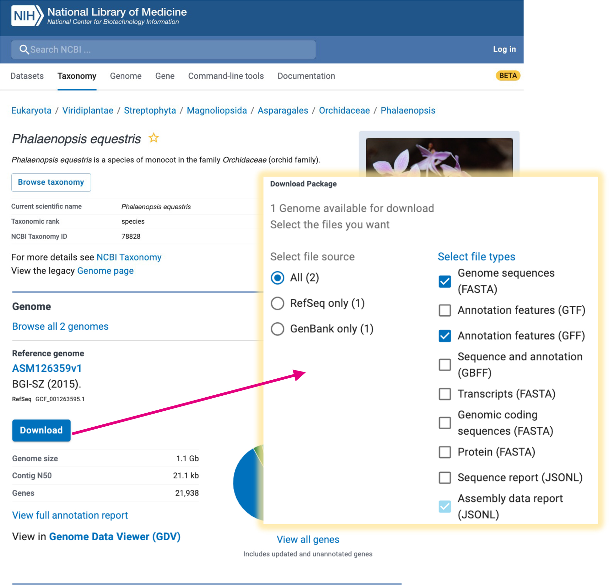
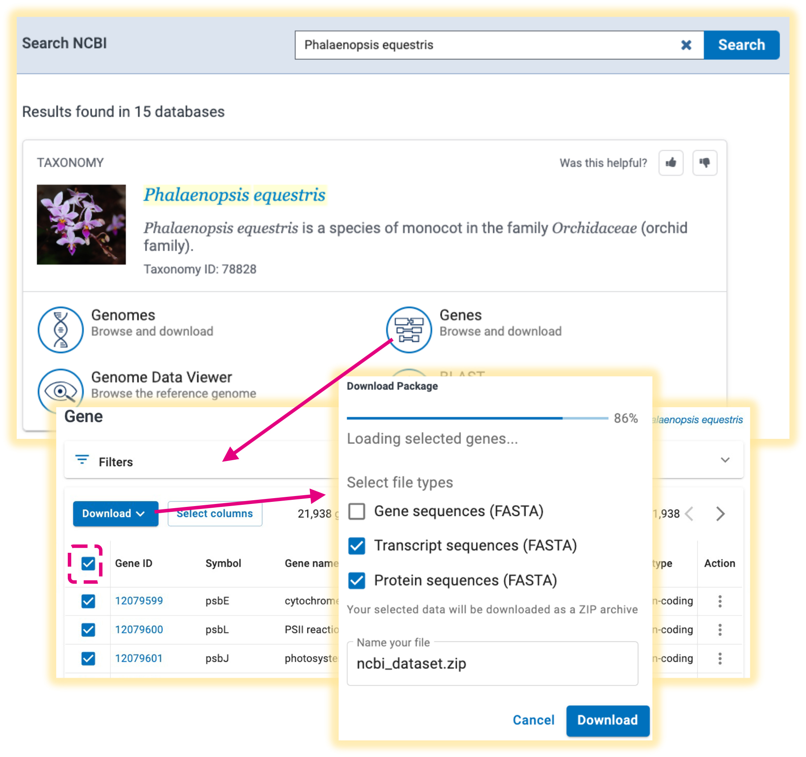
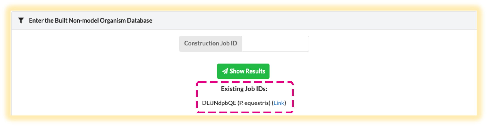
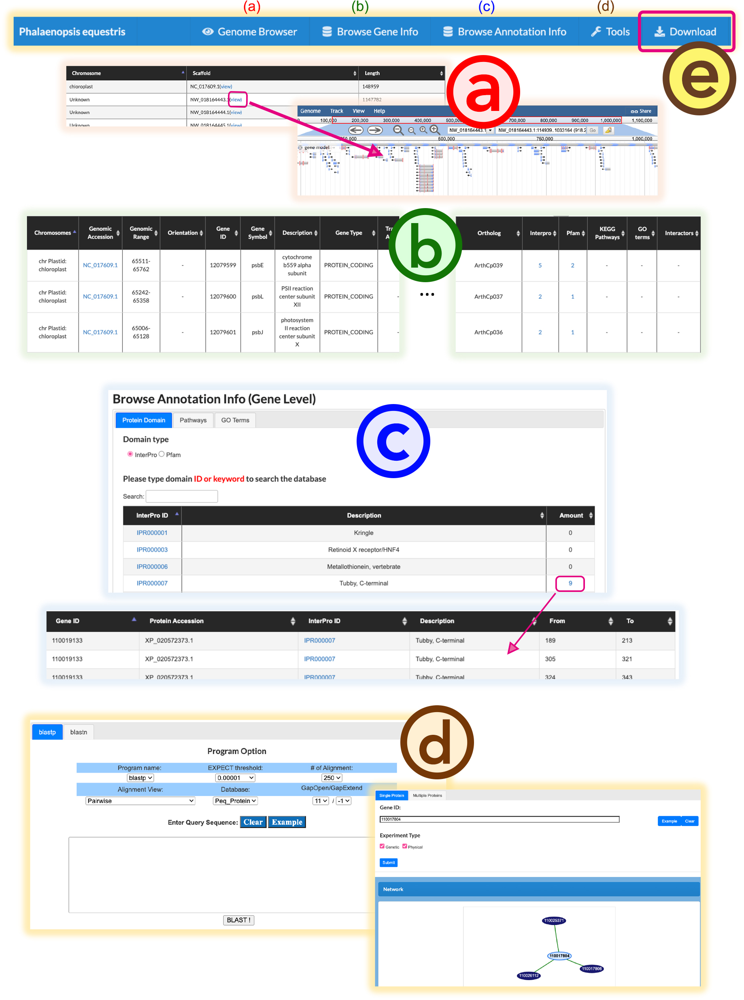

# *NoAC*: an automatic builder for knowledge bases and browsers in non-model organisms


### Related paper:

Tzu-Hsien Yang, Chien-Chi Liao, You-Yi Chen, Chun-Lin Hsieh, Wen-Chieh Tsai, Yan-Yuan Tseng, and Wei-Sheng Wu\*, "NoAC: an automatic builder for knowledge bases and browsers in non-model organisms," (Under Review)

## Start the Environment

We recommend using Docker to set up the necessary environments for NoAC. 

Here is an example: 

1. Install the Docker software. If you have already installed the Docker software, please skip this step. 

If you are using Microsoft Windows systems, please follow the instructions <a href="https://docs.docker.com/desktop/install/windows-install/">here</a>.

If you are using Mac OS systems, please follow the instructions <a href="https://docs.docker.com/desktop/install/mac-install/">here</a>.

2. Start the Docker program by double-clicking the Docker icon.

***
Please do not stop the Docker program during the execution of the web service.
***

3. Open the command line interface of your system and type

```
docker pull nmokbc/nmokbc:latest

```

to get the latest version of NoAC.

4. Set up the local web service environment:


```
docker run -d --restart=unless-stopped -p 8000:8000 --name NOAC nmokbc/nmokbc python /Django/NMOKBC/manage.py runserver 0.0.0.0:8000
```

5. Visit the local *NoAC* website by entering the following sites onto the browser URL block:


```
localhost:8000/input
```

6. If you have already built up the *NoAC* website before, use the following commands to restart the *NoAC* website:

```
docker start NOAC
```

## Steps to Use *NoAC*

Users can specify the information of the non-model organism of interest in the "Input" tab page. Only two steps are required to build the inferred knowledge base for this non-model organism:


1. Upload the following four genome information for the non-model organism of interest:

>* genomic.fna: Genomic sequence
>* genomic.gff: Genomic annotations
>* protein.faa: Protein sequences
>* rna.fna: transcript sequences
>* data_table.tsv: summary table generated by NCBI

These files can be downloaded from the NCBI website:

(1) Download *genomic.fna* and *genomic.gff*:


(2) Download *protein.faa*, *rna.fna*, and *data_table*:


2. Select the referenced model organism and press submit.

The data processing steps may take several hours to proceed. After finishing the data processing steps, the web query interface for the non-model organism knowledge base can be accessed via the provided link. 

## Constructed Non-model Organism Query Interfaces

The construction of a new knowledge and its query interface may take several hours. In the "Result" tab page, users can type in the existing Job IDs to link to the constructed query interfaces. And the existing knowledge bases on the user's computer are also listed in this tab page.




## How to Utilize the Constructed Query Interface




### (a) Function 1: Genome Browser

1. Click the scaffold name to launch the JBrowse for browsing and visualization of the locations of the genes in the selected scaffold.

### (b) Function 2: Browse Gene Info

1. Press the link of a genomic accession ID, and users will be directed to a JBrowse page, which visualizes the related RNA/protein isoforms of this gene. 

2. Click the links in the columns of ”InterPro,” “Pfam,” “KEGG Pathways,” ”GO Terms,” and ”Interactors” for a given gene, and users will be directed to the detailed pages of the predicted information of protein domains from InterPro, protein domains from Pfam, KEEG pathways, and the genes with protein-protein-interactions, respectively.

### (c) Function 3: Browse Annotation Info

1. Users can investigate the annotation terms based on gene-level or transcript-level categorization. 

2. Three annotation aspects (protein domain, pathway, and GO) can be poured over.


### (d) Function 4: Tool


1. Search Similar Genes: key in any protein/RNA sequence of interest to identify the similar protein/RNA sequences in this non-model organism based on BLASTP/BLASTN.

2. Construct Network: build up the network consisting of the physical and genetic interactions among a given gene list in the non-model organism.

### (e) Function 5: Download information

Download the data deposited for this knowledge base.

## Some Possible Issues

Here, we collect some common issues users may encounter when using NoAC:

Case (1): port already in use.

```
Error response from daemon: driver failed programming external connectivity on endpoint NMOKBC (b6ca699f4826dcad781912c88f511d9c02ea0e48838c37c552a07591f65c73ff): Error starting userland proxy: listen tcp4 0.0.0.0:8000: bind: address already in use
```
Solution: 

Change the binding port by the following comamnds:

```
docker run -d --restart=unless-stopped -p 8080:8080 --name NOAC nmokbc/nmokbc python /Django/NMOKBC/manage.py runserver 0.0.0.0:8000
```

Then, the website will be available at 

```
localhost:8080/input
```


Case (2): container name conflict. 

```
Error response from daemon: Conflict. The container name "/NOAC" is already in use by container "9f94a2307233aef5c66487b36a9a4ad48bab1fdfe8455fbcae61e4a2c1063dc4". You have to remove (or rename) that container to be able to reuse that name.
```

Solution: 

Start the existing website with the following command.

```
docker start NOAC
```